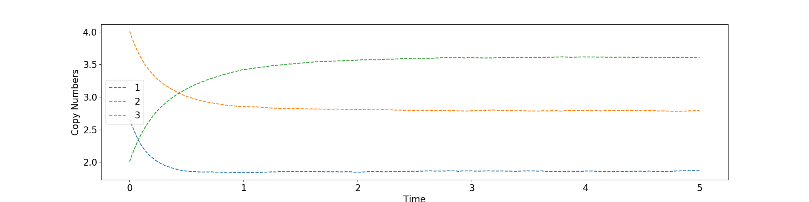
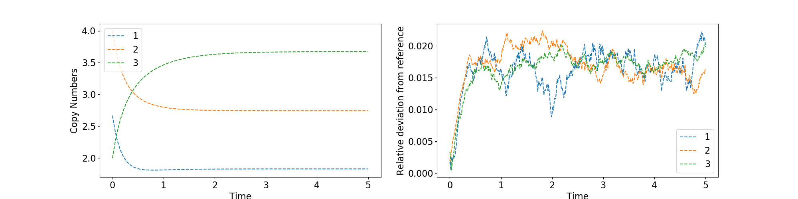
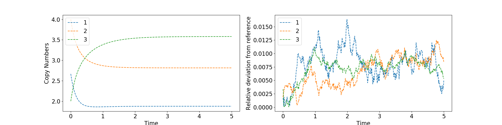
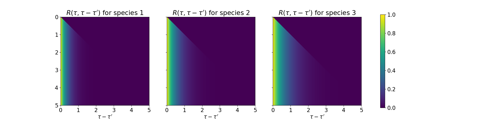
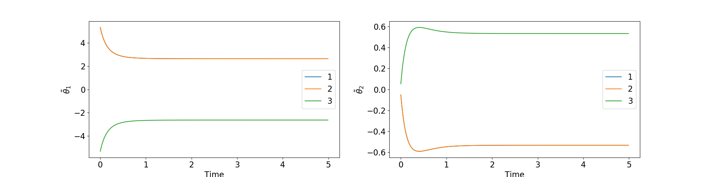

# CRN.jl

Framework for Chemical Reaction Networks. Code for my Master's thesis. Last updated: Dec. 2020 (c) Maximilian Kurjahn

## Install this package

Open `julia`, type "`]`" to go to the package mode and then add the package by
```julia 
pkg> add https://github.com/mkurjahn/CRN.git
```

Go back to the normal mode with backspace and use the package via
```julia
using CRN
```

## Example Usage

The usage of this framework will be demonstrated for the simple reaction $A+B\rightarrow C$ on top of the baseline reactions $X_i\rightleftharpoons\varnothing$ for $X_i\in\lbrace A,B,C \rbrace$. This means that the number of species is `num_species = 3` and number of interaction reactions is `num_int = 1`. 

### Define Parameters
Define reaction constants for creation, annihilation and interaction reaction, respectively.
```julia
k1 = [8, 8, 3]      # Creation
k2 = [3, 2, 1.5]    # Annihiliation
k3 = [0.5]          # Interaction
k  = [k1, k2, k3]
```

Define the stoichiometric matrices for each interaction reaction
```julia
s_i = zeros(Int, num_int, num_species)
r_i = copy(s_i)
s_i[1,:] = [0 0 1]
r_i[1,:] = [1 1 0]
```

Define start time, end time and time step Δt
```julia
t_init  = 0.0    # start time
t_final = 5.0    # end time
delta_t = 0.01   # time step
```

As initial condition the steady state is chosen where we have no interaction reaction, i.e. `k3 = 0`, which is then `x0 = k1 ./ k2`. Combine all simulation parameters:
```julia
p = Parameters(x0, k, s_i, r_i, t_init, t_final, delta_t)
```

### Gillespie simulation
Averaging the stochastic simulation over `100,000` different trajectories. Getting the result and plotting it with
```julia
res_gil = gillespie_avg(p, 100000)
plot_trajectories(res_gil)
```


### Plefka linear order parameters

Define the Plefka expansion with the α-value, α-order (up to first [1] or second [2] order) and the used order parameters ("linear" or "quad"). In this example, we only investigate the difference between first and second order in α for linear order parameters. 

Truncating the expansion at first-order of α, we get the results by
```julia
plf_1 = Plefka(1.0, 1, "linear")
res_plf_1 = euler_step(p, plf_1)
plot_trajectories_and_deviation(res_plf_1[1], res_gil)
```


For second order of α, we get the results by
```julia
plf_2 = Plefka(1.0, 2, "linear")
res_plf_2 = euler_step(p, plf_2)
plot_trajectories_and_deviation(res_plf_2[1], res_gil)
```


We have now access to the response functions and correction fields:
```julia
plot_responses(res_plf_2[2])
plot_hatTheta(ts, res_plf_2[3])
```


